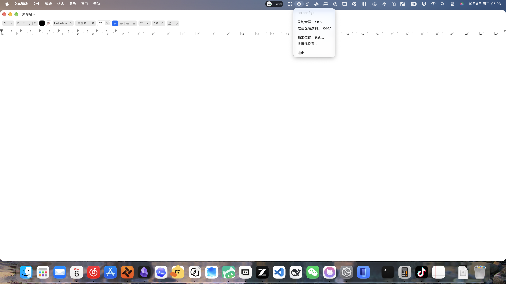
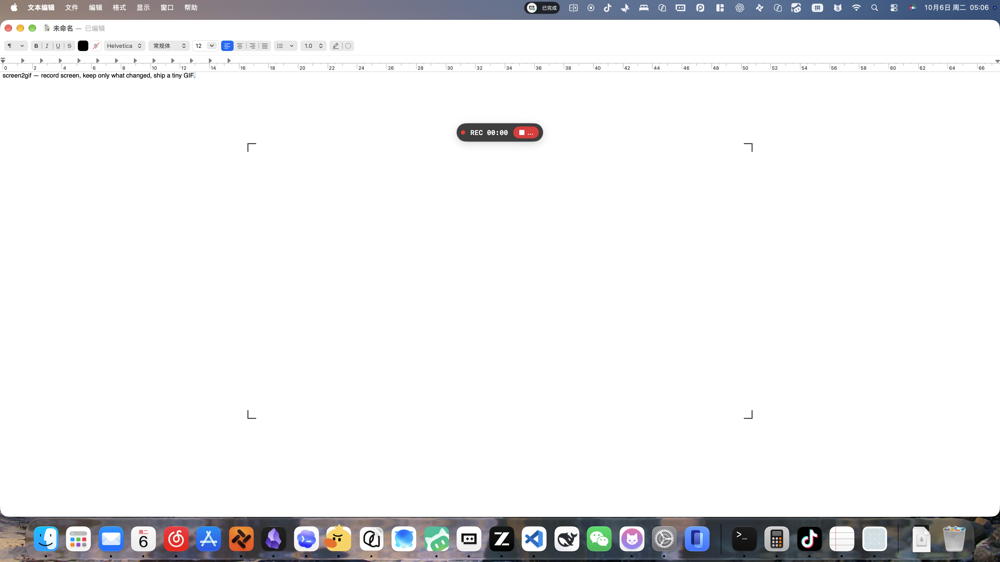
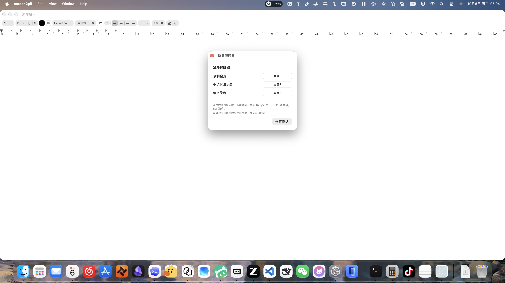

# screen2gif

把 macOS 屏幕操作变成精简 GIF：**录屏 → 只保留真正变化的关键帧 → 裁掉静止的无关区域 → 调色板编码**。

一段 12 秒、含大量静止等待的 4K 录屏，通常能压成 900px 宽、几十帧、1MB 左右的 GIF，且画面里只剩动过的部分。


## 依赖

- macOS（用系统自带 `screencapture` 录屏）
- Node.js ≥ 18（仅用标准库，无 npm 依赖；没装时运行 CLI 会直接提示 `brew install node`）
- ffmpeg / ffprobe：**不需要提前装**——第一次运行 `record` / `convert` 检测到缺失时，会询问是否现在通过 Homebrew 自动安装（非交互环境给出手动安装命令）
- 「屏幕录制」权限：macOS 把权限授给**运行命令的终端 app**（Terminal / iTerm / Qoder 各自独立，换终端要重新授权）。缺权限时录屏是 0 字节——CLI 会自动打开系统设置的授权面板，并指名该勾选哪个 app

## 安装

无需安装。clone 后直接调用：

```sh
git clone https://github.com/bubble-wu/screen2gif.git
cd screen2gif
./bin/screen2gif doctor                  # 自检依赖与权限
./bin/screen2gif record -d 8 -o demo.gif
```

想全局可用：`ln -s "$(pwd)/bin/screen2gif" /opt/homebrew/bin/screen2gif`（在 clone 目录里执行），或在 shell 里 `alias s2g='<clone 路径>/bin/screen2gif'`

### 作为 agent skill 使用

仓库根目录带 `SKILL.md`，可注册给你所用的 agent：把整个目录（或 symlink）放进技能目录，例如 `ln -s "$(pwd)" ~/.agents/skills/screen2gif`。

输出位置：不传 `-o` 时默认存**当前目录**（`s2g-<时间戳>.gif`）；`-o` 也接受目录（已存在或以 `/` 结尾），自动往里放时间戳文件名，`~/` 前缀会展开。菜单栏 app 默认存桌面，菜单里的「输出位置…」可改。

## 快速上手

```sh
s2g record -d 8 -o demo.gif              # 录 8 秒并出图
s2g record -o demo.gif                   # 交互终端：Enter 开始 → Enter 停止
s2g record -I -o demo.gif                # 用 macOS 原生工具条，菜单栏按钮停止
s2g record --region window -d 6 -o d.gif # 只录前台窗口
s2g record --then 'bash 操作脚本.sh' -o d.gif   # 边录边执行命令，命令结束即停
s2g convert 已有录屏.mov -o demo.gif      # 转已有视频
s2g convert in.mov -o d.gif --crop off   # 不裁剪
s2g convert in.mov -o d.gif --crop 200,100,1600,1000
```

## 开始与结束

四种控制方式，都有倒计时和提示音（每秒一声 Tink，开始一声 Glass，结束一声 Tink）：

| 方式 | 开始 | 结束 |
|---|---|---|
| `-d <秒>` | 倒计时后自动 | 到时自动 |
| `--then '<命令>'` | 立即（倒计时默认 0） | 命令（交 `sh -c`，输出透传）退出即停 |
| 手动（默认，需 TTY） | 终端按 Enter | 终端再按 Enter，或 Ctrl-C |
| `-I, --interactive` | 倒计时后自动开始，同时弹出原生录制工具条 | 菜单栏停止按钮（任何 App 里都能点），或终端 Enter / Ctrl-C |

`--countdown 0` 跳过倒计时，`--silent` 关闭提示音。Ctrl-C 走的是同一条停止路径，会正常写完文件并继续转码。`-I` 的时长由停止按钮决定，所以不能与 `-d` 同用；`--then` 的时长由命令决定，不能与 `-d` / `-I` 同用，命令退出码非 0 时仍会出图（ stderr 给警告——失败的操作过程往往正是要看的）；`--region` 在两者下都有效。

### 给 agent / 脚本：自动化编排

让程序驱动屏幕操作并录下来，两种范式：

```sh
# 范式一：--then 一条龙（首选）——真正开录后才执行命令，命令退出即停
s2g record --then 'bash drive-ops.sh' --json -o demo.gif

# 范式二：外部编排——--ready-file 在 screencapture 拉起那一刻才创建
# （距实际出画约百毫秒，通常无感），等它出现再动手，操作不会被倒计时吞掉开头
#（起跑前先 rm 掉旧信号，避免误读残留）
rm -f /tmp/s2g-ready
s2g record -d 15 --countdown 0 --ready-file /tmp/s2g-ready -o demo.gif &
while [ ! -f /tmp/s2g-ready ]; do sleep 0.2; done
# ……执行要被录下来的操作……
wait
```

`--json` 成功时在 stdout 输出单行结果（`gif` 路径、`bytes`、`frames`、`gifDuration`、`crop`、`elapsed`，`--then` 时含 `commandExit`），供程序化取用，不必解析人话日志。时长宁长勿短：静止画面会被关键帧抽取与 `--max-gap` 压掉，多录不亏。

## 管线是怎么工作的

1. **录屏**：`screencapture -v` 产出 4K VFR 的 .mov。定时用 `-V`，手动停止发 SIGINT（screencapture 只在收到 SIGINT 时才写完 moov atom）。`-I` 走 `screencapture -J video`，即系统自带的录制工具条，因此能在菜单栏点按钮停止。
2. **关键帧**：`mpdecimate` 丢弃与上一保留帧几乎相同的帧（变化检测），再用 `select` 按 `1/--fps` 设最小间隔。屏幕录制的整帧 `scene` 分数天然极低（一行文字只改 ~1% 像素），所以不用它做主判据。
3. **自动裁剪**：把关键帧解码成 PNG 后做相邻帧差分 + 噪声门限 + `cropdetect`，得到所有运动的包围盒，换算回源分辨率并留白。
   注意：差分**不能**直接在 .mov 上做——`tblend` 对 screencapture 的流会给出恒定的假偏移；解码成 PNG 后差分才准确。
4. **编码**：关键帧 PNG 按各自时间间隔写成 concat 清单，`palettegen` + `paletteuse` 两遍编码（比单遍小一个数量级），`-loop 0` 无限循环。

## 参数

见 `s2g --help`。要点：

- `--sensitivity low|default|high`：`mpdecimate` 档位。4K 录屏每帧都带压缩噪声，ffmpeg 面向电影的默认值在这里反而是最不敏感的一档。
- `--crop auto|off|x,y,w,h`：`auto` 检测运动包围盒；运动覆盖全画面时自动退化为不裁剪。
- `--region screen|window|x,y,w,h`：录制范围，单位是屏幕点（录屏输出为 2 倍像素）。
- `--max-gap`：单帧最长停留，把长静默截断，避免 GIF 看起来卡死。
- `--then '<命令>'` / `--ready-file <路径>` / `--json`：自动化编排三件套，见上节。
- `--keep-frames` / `--keep-mov`：保留中间产物供检查。

## 故障排查

| 现象 | 原因与处理 |
|---|---|
| 录屏文件只有几 KB | 缺屏幕录制权限，按报错里的路径授权 |
| 录制进程不结束、无输出 | 录屏会话卡死（通常因上次录制被 `kill -9`）。`killall ControlCenter` 或注销恢复 |
| `--region window` 报错 | 前台应用不向 System Events 暴露窗口，改用 `--region x,y,w,h` |
| 关键帧只有几帧 | 画面确实没怎么动；或 `--sensitivity` 太低 |
| GIF 体积大 | 降 `--width` / `--fps` / `--max-frames`；确认没加 `--no-palette` |

## 原生菜单栏 app（人在电脑前时更好用）



`native/` 里是一个 SwiftUI 菜单栏 app：点图标选「录制全屏」或「框选区域录制…」（屏幕上拖拽，Esc 取消），也可以直接用全局快捷键。开始和结束各有一声提示音（Glass / Tink），圈选录制时选区四周是取景角标（画在选区之外，不会入镜）。录完自动调用本仓库的 CLI 转码并在 Finder 里揭示成品 GIF。GIF 默认存桌面，菜单里的「输出位置…」可换目录（记忆在 UserDefaults，面板里也能新建目录）。采集走 ScreenCaptureKit（`SCRecordingOutput` 直接写 .mov），区域用 `SCStreamConfiguration.sourceRect` 裁（注意它是所选显示器自己的逻辑坐标系）。圈选录制转码时自动加 `--crop off`——圈选已经表达了取景意图，不再做运动区域裁剪；全屏录制保留 `--crop auto`。

### 录制状态条



录制中屏幕顶部会出现一条深色胶囊状态条（全屏和框选共用同一套）：红色 REC 圆点每秒闪烁、等宽数字计时、右侧「停止」按钮点一下即停——不用再去找菜单栏图标。它对鼠标点击生效但**不抢焦点**（nonactivating panel），点停止不会把正在演示的应用晃出去。框选时状态条在选区正上方（选区外，天然不入镜；选区贴屏幕顶时移入选区内）；全屏时在主屏顶部菜单栏下方，靠 `SCContentFilter(excludingWindows:)` 从采集里剔除，**不会被录进成片**。

框选录制时选区四周是四个细角标（取景框风，白色 halo + 深灰主线，深浅背景都清晰），不画边、中间零遮挡。框选确认的一瞬间：选区内容先深虚化、再与角标收拢同步拉清晰（`SCScreenshotManager` 抓一帧快照 + CoreImage 高斯半径收敛），到位后角标闪一下——「对焦清晰 = 录制开始」，Glass 提示音正好在画面清晰那一刻响起。这段开场只给你看：overlay 窗口本来就在采集剔除名单里，虚化与角标都不会录进成片。

### 全局快捷键

| 动作 | 默认 | 可改 |
|---|---|---|
| 录制全屏 | ⇧⌘6 | 菜单 → 快捷键设置… |
| 框选区域录制 | ⇧⌘7 | 同上 |
| 停止录制 | ⇧⌘8 | 同上 |



默认排在系统截屏键 ⇧⌘5 后面。设置窗口里点击条目即可录入新组合（需含 ⌘/⌃/⌥ 之一，⌫ 禁用，Esc 取消），改完即存即生效，无需重启。实现走 Carbon `RegisterEventHotKey`（系统级热键，无需辅助功能权限）；冲突时注册失败，换个组合即可。

```sh
cd native && ./build.sh && open build/screen2gif.app
```

已知限制：框选 overlay、状态条、角标都画在主屏；多显示器下只能在主屏框选（全屏录制也默认主屏），副屏内容不会入镜。

注意：屏幕录制权限归属这个 .app，而且系统不会主动弹授权框（菜单栏 agent + 本地签名），必须手动加一次：系统设置 → 隐私与安全性 → 屏幕与系统录音 → `+`，选 `native/build/screen2gif.app`。app 启动时即自检权限与依赖：缺权限时菜单直接出现「打开屏幕录制设置…」，缺 node/ffmpeg 时出现「安装缺失依赖…」（走 Homebrew，装完即用），不用等第一次录制失败才发现。`build.sh` 用自签名证书 `screen2gif Dev`（login keychain 中受信任的代码签名根）签名，designated requirement 只认 bundle id + 证书哈希，所以重建不会掉授权；证书若丢失，脚本会退回 ad-hoc 并告警，那时每次重建都得重新授权。构建还依赖 `~/Developer/.swift-sdk-fix/` 的工具链补丁（原因见 `native/build.sh` 头部注释）。agent 调用仍走 CLI。

## 目录

```
screenshots/     README 演示截图
bin/screen2gif   CLI 入口与参数解析
lib/record.mjs   screencapture 封装（定时/手动/外控停止、看门狗、窗口区域、就绪信号）
lib/video.mjs    ffprobe 探测、关键帧抽取、运动包围盒、GIF 编码
native/          菜单栏 app（ScreenCaptureKit 采集 + 框选 overlay + 调 CLI 转码）
SKILL.md         给 Qoder 的技能说明
```
