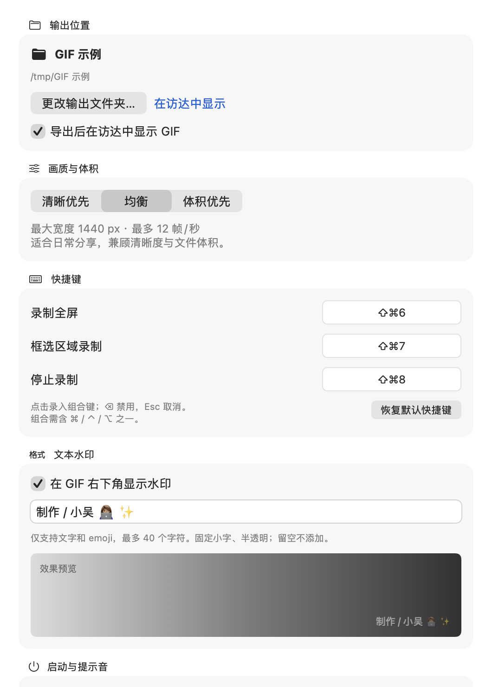
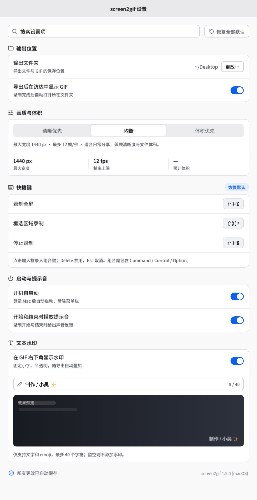

# macOS App 使用说明

[返回首页](../README.md) · [CLI 使用说明](cli.md)

## 下载与首次打开

[直接下载 v1.5.0](https://github.com/bubble-wu/screen2gif/releases/download/v1.5.0/screen2gif-v1.5.0-macOS.zip)（约 13 MB）· [所有版本](https://github.com/bubble-wu/screen2gif/releases)

预编译包适用于 **macOS 15+、Apple Silicon（M1 及更新芯片）**。Intel Mac 请参考[从源码构建](development.md)。App 已内置转码 CLI，移动 App 不依赖仓库位置；Node.js ≥ 18 和 ffmpeg / ffprobe 仍需另行安装。

1. 解压 ZIP，把 `screen2gif.app` 拖入「应用程序」，再打开。
2. 如果系统提示无法验证开发者，先尝试打开一次，再进入「系统设置 → 隐私与安全性」，点击「仍要打开」，确认打开。当前包使用自签名证书，首次打开操作参见 [Apple 官方说明](https://support.apple.com/zh-cn/102445)。
3. 菜单提示「安装缺失依赖…」时，点击安装（需要已有 [Homebrew](https://brew.sh)）；也可以自行在终端执行 `brew install node ffmpeg`。
4. 在「系统设置 → 隐私与安全性 → 屏幕与系统录音」中启用 `screen2gif`；列表没有时点 `+`，选择「应用程序」中的 `screen2gif.app`。授权后退出并重新打开 App。

权限归属这个 App；CLI 的权限则归属运行命令的终端，两者需要分别授权。

## 录制与导出

菜单栏点击取景框图标，选择「录制全屏」或「框选区域录制…」。框选时在屏幕上拖拽，Esc 取消。录制中点击状态条的「停止」，或按停止快捷键；结束后自动转码，默认在访达中显示 GIF。

GIF 默认存桌面，可在「设置… → 输出位置」中更改；菜单里的「打开 GIF 存储目录」会打开当前输出文件夹。目录移动或无法访问时会提示重新选择。

全屏录制会自动裁掉静止区域；框选录制保留你选定的范围，不再自动裁剪。采集使用 ScreenCaptureKit，录制状态条与选区角标会从采集中排除。

### 文本水印

「设置… → 文本水印」可填写文字（含中文和彩色 emoji，最多 40 个字符），并单独开启或关闭。默认关闭，空白文字不添加水印；关闭会保留文字。固定使用系统字体、白色半透明小字和轻微暗色阴影，在最终 GIF 右下角留出边距，小画面会自动缩小。设置提供即时预览，不支持图片或自定义位置、颜色。

水印随开始录制时的设置一起快照，本次录制期间修改从下一次生效。叠加发生在裁剪与缩放之后、调色板生成之前，避免改变取景或影响关键帧检测。文字由 AppKit 绘制以支持彩色 emoji，不依赖 ffmpeg 的 `drawtext`。独立 CLI 默认不读取 app 水印设置。

### 录制状态条

录制中屏幕顶部会出现一条深色胶囊状态条（全屏和框选共用同一套）：红色 REC 圆点每秒闪烁、等宽数字计时、右侧「停止」按钮点一下即停——不用再去找菜单栏图标。它对鼠标点击生效但**不抢焦点**（nonactivating panel），点停止不会把正在演示的应用晃出去。框选时状态条在选区正上方（选区外，天然不入镜；选区贴屏幕顶时移入选区内）；全屏时在主屏顶部菜单栏下方，靠 `SCContentFilter(excludingWindows:)` 从采集里剔除，**不会被录进成片**。

框选录制时选区四周是四个细角标（取景框风，白色 halo + 深灰主线，深浅背景都清晰），不画边、中间零遮挡。框选确认的一瞬间：选区内容先深虚化、再与角标收拢同步拉清晰（`SCScreenshotManager` 抓一帧快照 + CoreImage 高斯半径收敛），到位后角标闪一下——「对焦完成且采集就绪 = 录制开始」，Glass 提示音会等待对焦动画和实际写入都就绪；准备时显示「准备录制…」，可以取消，REC 和计时不会提前出现。这段开场只给你看：overlay 窗口本来就在采集剔除名单里，虚化与角标都不会录进成片。

### 设置与画质

菜单 →「设置…」，按「搜索与重置 → 输出位置 → 画质与体积 → 快捷键 → 启动与提示音 → 文本水印 → 保存状态」排列在原生滚动窗口内，窗口高度适配屏幕。没有打开设置的快捷键；录制全屏、框选与停止的快捷键仍可配置。也可以重新打开正在运行的 app 来显示设置；从终端打开已安装 App 的设置可用 `open /Applications/screen2gif.app --args --settings`。

「开机自启动」在首次启动新版时默认注册到 macOS 登录项（用户登录 Mac 后启动并常驻菜单栏）。之后关闭不会被下次启动重新开启。在系统设置中修改登录项后，回到 app 会刷新真实状态；若 macOS 要求批准，会显示说明和「打开系统登录项设置」，不会把等待批准当作已开启。注册失败同样显示原因，可通过开关重试。实现使用 `SMAppService.mainApp`，无需另装后台脚本。

搜索按分区筛选；「恢复全部默认」恢复输出、画质、提示音、导出后显示、水印、快捷键和默认开启的登录项。预计体积显示「—」，悬停说明录制时长、区域与画面变化会影响最终体积。

| 画质 | 输出宽度上限 | 关键帧率上限 | 关键帧总数上限 | 适用 |
|---|---|---|---|---|
| 清晰优先 | 原始像素，不缩放 | 20 fps | 600 | 文字、代码、细节演示；文件较大 |
| 均衡（app 默认） | 1440 px | 12 fps | 360 | 日常分享，比旧版 900 px 更清晰 |
| 体积优先 | 720 px | 8 fps | 180 | 短小动图；小字清晰度较低 |

宽度只缩小、不放大；保留画面变化的关键帧，长录制超过总帧数上限时会进一步抽样。CLI 独立调用仍保留原默认参数（900 px / 10 fps / 240 帧），不读取 app 偏好。GIF 仍受调色板颜色数量限制，清晰优先并不等于无损视频。

设置自动保存，原来选择的输出文件夹会保留。开始录制时固定本次设置，中途修改从下一次录制生效；快捷键修改立即生效。提示音和「导出后在访达中显示 GIF」默认开启，可以分别关闭。

### 全局快捷键

| 动作 | 默认 | 可改 |
|---|---|---|
| 录制全屏 | ⇧⌘6 | 菜单 → 设置… → 快捷键 |
| 框选区域录制 | ⇧⌘7 | 同上 |
| 停止录制 | ⇧⌘8 | 同上 |

默认排在系统截屏键 ⇧⌘5 后面。设置窗口里点击条目即可录入新组合（需含 ⌘/⌃/⌥ 之一，⌫ 禁用，Esc 取消），改完即存即生效，无需重启。实现走 Carbon `RegisterEventHotKey`（系统级热键，无需辅助功能权限）；冲突时注册失败，换个组合即可。

## 已知限制与故障排查

- App 的全屏录制与框选均使用主屏，副屏内容不会入镜；CLI 可通过 `--display` 指定显示器。
- 缺屏幕录制权限时，菜单会出现「打开屏幕录制设置…」；授权后如仍失败，退出并重新打开 App。
- 缺 Node.js / ffmpeg 时，菜单会出现「安装缺失依赖…」；没有 Homebrew 时会打开其官网。
- 录制会话卡住时，可运行 `killall ControlCenter`（菜单栏会重启）或注销登录后重录。不要用 `kill -9` 强行结束录制。
- 重建时若改用 ad-hoc 签名，需要重新授予屏幕录制权限；签名与构建细节见[开发说明](development.md)。
